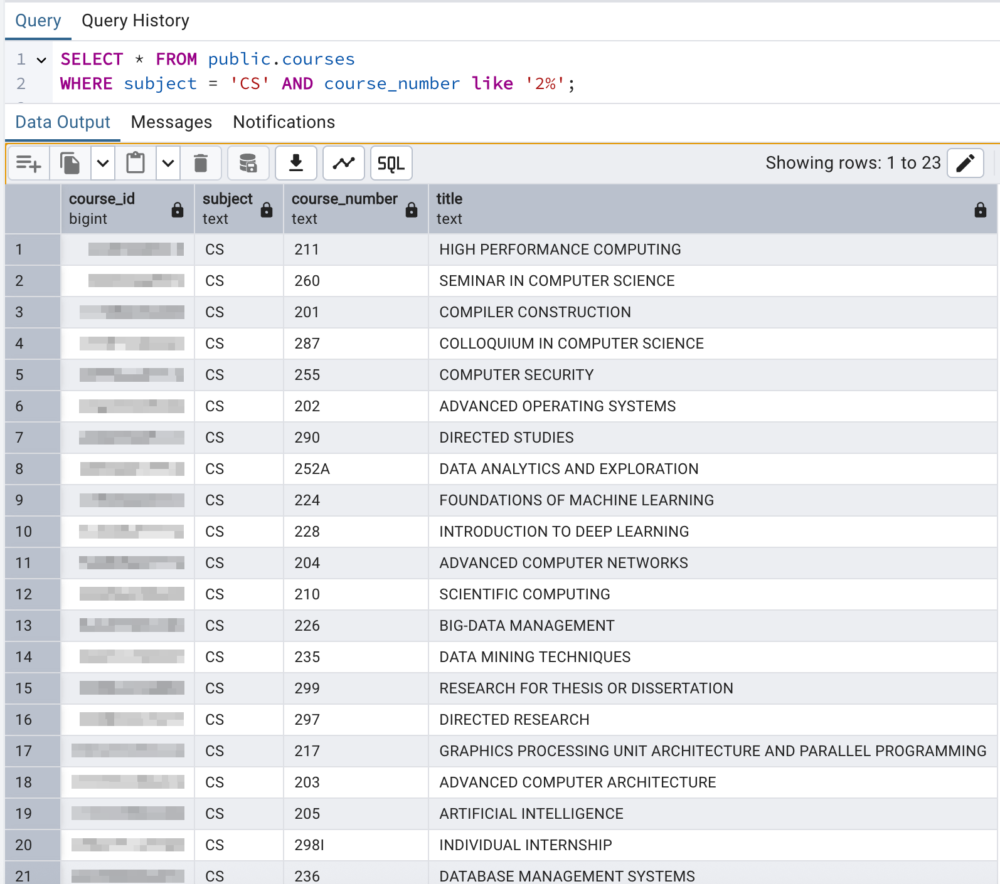

# Data Science Fellowship 2025 – Schedule Recommendation Chatbot (POC)

## The Problem

This project is a work-in-progress proof of concept for a chatbot that assists students in creating personalized and valid course schedules. Given a student's degree requirements and previously completed coursework, the chatbot generates a recommended schedule for a specific academic quarter.

---

## The Ideology

We aim to implement a pipeline that works as follows:

1. **User Input via Chatbot**  
   The user interacts with the chatbot through the UI—for example, by asking, "Generate a schedule for me for the upcoming quarter."

2. **Backend Data Retrieval**  
   Based on the user's request, the system makes multiple database calls to gather relevant information, including:

   - Courses the student has already completed
   - Degree requirements for their major (this is currently done through a DAG; however, we may need to rethink this due to students having double major and minor)
   - We can potential create the dags on the go using pre-req database retreival or store DAGs for all degrees in the database
   - Courses being offered in the upcoming or current quarter

3. **Constructing the Candidate Course Pool**
   Using the retrieved data, we build a data structure—planned to be a **Priority Queue**—that contains all valid course options the student is eligible to take this quarter, based on the constraints above.

4. **LLM-Based Course Selection**  
   This structured list is passed to an LLM, which selects a suitable set of courses from the queue based on the user input.

5. **Fetching Schedule Details**  
   Once the courses are selected, the system may query the database again to fetch details necessary to generate the final schedule (e.g., times, locations).

6. **Display to User**  
   The finalized schedule is then rendered to the user in a calendar-style format via the UI.

## Potential Problems and Their Solutions

1. **LLM Hallucinations**  
   One known issue with large language models (LLMs) is hallucination—where the model generates incorrect or fabricated information. To mitigate this, we limit the amount of data sent to the LLM. Instead of providing the full dataset, we supply only the necessary and pre-filtered information (based on degree requirements, interests, and completed courses). This data is structured in a controlled format using the priority queue mentioned earlier. So far, in our small-scale, hardcoded prototype, we have not encountered hallucination issues.

2. **LLM Omitting Important Courses**  
   Despite feeding minimal and relevant data to the LLM, there is still a possibility that it might overlook a critical course, which would be a significant failure. To address this, we perform a validation check on the course plan generated by the LLM. This ensures that core requirements are fulfilled and the schedule is valid. If any required course is missing or an error is detected, we prompt the LLM to regenerate the schedule. This validation step occurs internally before presenting the final schedule to the student.

## Install & Setup

To ensure a consistent and reproducible development environment across all machines, we use a virtual environment. This isolates dependencies and prevents conflicts with other projects.

Follow these steps to set up the project environment:

1. **Create the Environment**  
   We use `conda` to create the environment from the provided `environment.yml` file, which lists all the base dependencies required to run the project.

   ```bash
   conda create -f environment.yml
   ```

2. **Activate the Environment**  
   Once the environment is created, activate it using:

   ```bash
   conda activate ds_fellow
   ```

3. **Install Additional Dependencies (if needed)**  
   Some packages may not be available via `conda` and might need to be installed via `pip`. For this, we maintain a `requirements.txt` file as a placeholder for such packages:

   ```bash
   pip install -r requirements.txt
   ```

## ✅ Current Progress

### 🔹 1. Extract: Fetch Course Data from Banner API

- Pulled raw course section data from UCR’s Banner API (Fall 2024 – `term=202440`)
- Saved raw JSON to: `data/raw/raw_courses.json`

  ```bash
  python src/1_banner_course_scrapper.py
  ```

### 🔹 2. Transform: Clean & Normalize Using PySpark

- Parsed nested JSON into structured 3NF tables using PySpark
- Output tables:
  - `courses.csv`
  - `sections.csv`
  - `instructors.csv`
  - `meeting_times.csv`
- Saved all files in: `data/cleaned/`

  ```bash
  python src/2_course_preprocess.py
  ```

### 🔹 3. Load: Push into PostgreSQL (via Docker)

#### 🐳 Pull the Official Postgres Image (if not already installed)

- First, make sure Docker is installed on your system.  
  Check the [official Docker site](https://www.docker.com/) for installation instructions.

  ```bash
  docker pull postgres
  ```

- Command used to create a local Postgres container with a preconfigured database:

  ```bash
  docker run --name dsf2025-postgres \
    -e POSTGRES_USER=postgres \
    -e POSTGRES_PASSWORD=password \
    -e POSTGRES_DB=dsf_2025_poc \
    -p 5432:5432 \
    -d postgres
  ```

- Data was loaded into this database using a Python script (`3_course_to_postgres.py`) powered by `pandas` + `sqlalchemy`.

  ```bash
  python src/3_course_to_postgres.py
  ```

##### 🧪 Example Query

Query to return all **graduate-level CS courses** offered in **Fall 2024**:

```sql
SELECT * FROM public.courses
WHERE subject = 'CS' AND course_number LIKE '2%';
```



---

## 🔜 Next Steps

<!-- - Create student mock profiles (completed courses + degree plan)
- Build a scheduling engine (prerequisite checking, conflict avoidance)
  - possibly build a DAG to have all the constraint for degree requiremenets which can be added to a queue based on which classes have been satisfied. Later the LLM (such as ChatGPT) can be used to plan out the schedule based on the queue and class offering lists.
- Wrap logic in a chatbot interface (e.g., Streamlit or Flask)
- Support real-time course updates (optionally rerun fetchers per quarter)
- need a api key for gemini at the moment (has to be fixed upon deployment)
- showcase the schedule using visualizations given the output -->

- As of now with no metadata for the actual data, the only part of the pipeline we can work on would be improving the UI.
